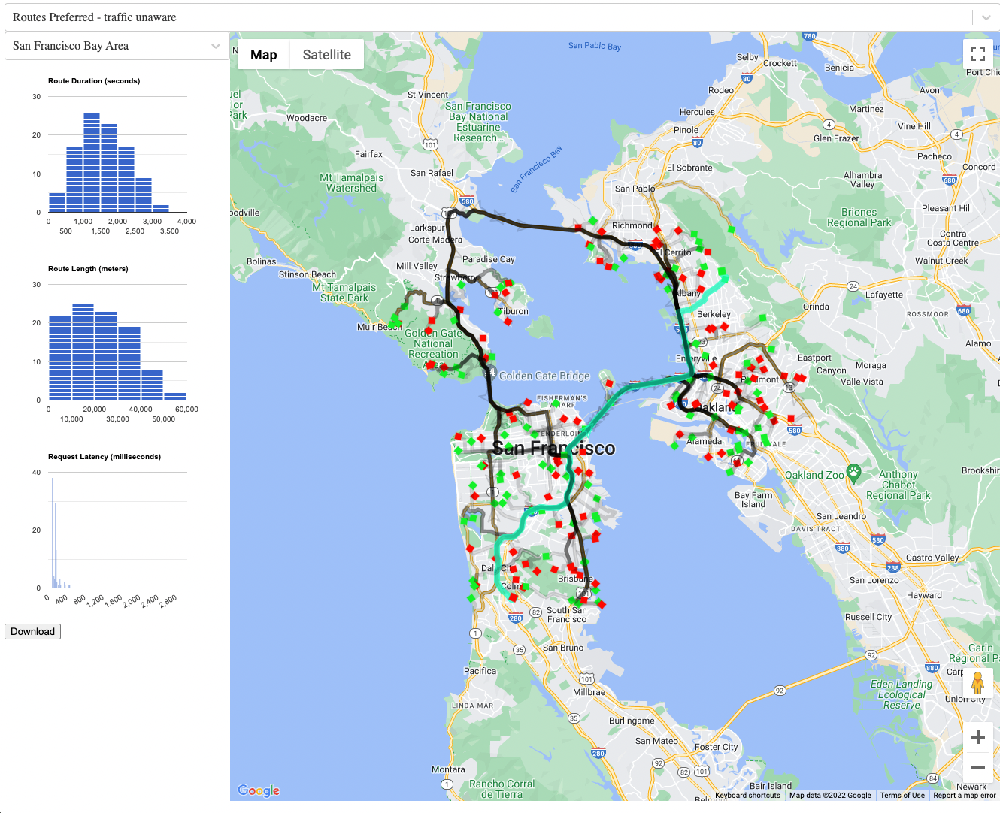

# Routing Playground

The routing playground allows generating and exploring routes
generated by directions and routes preferred.



## Disclaimer

This is not an officially supported Google product

## Getting Started

```
export REACT_APP_GOOGLE_MAPS_API_KEY=<your api key>
npm run start
```

## Using offline/pre-computed datasets

1) Select the datasets of interest and click the download button
2) Copy the downloaded files (preserving names) into public/
3) Add 'offline:true' flag to Data.js
4) npm run build
5) deploy build
